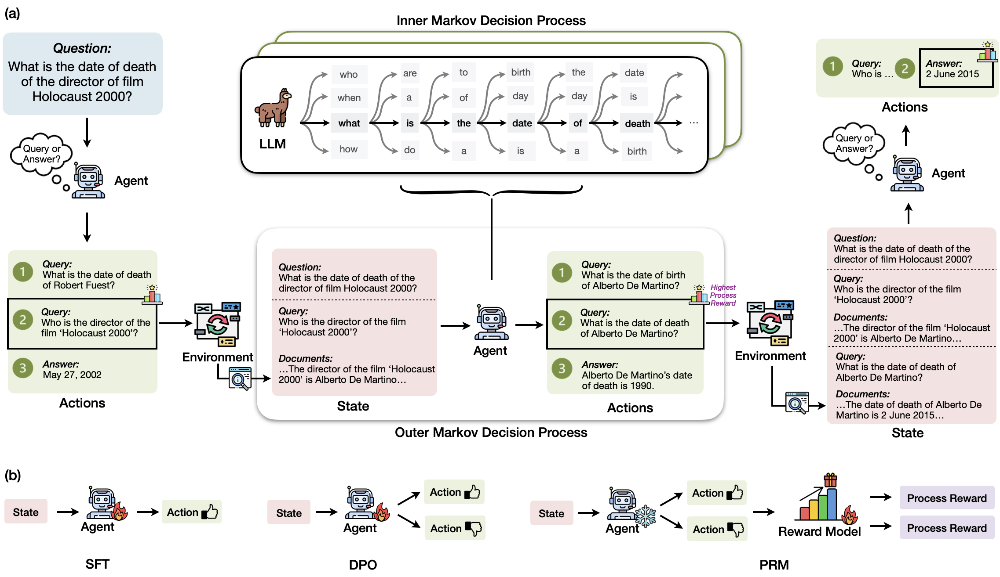

# Retrieval-Augmented Generation Gymnasium (RAG-Gym)

`RAG-Gym` is a unified framework for optimizing agentic RAG with process supervision.   

[](https://arxiv.org/abs/2502.13957)
[](https://rag-gym.github.io/)
[](https://huggingface.co/RAG-Gym)

## Table of Contents
- [Introduction](#introduction)
- [Requirements](#requirements)
- [Usage](#usage)
- - [Inference with RAG-Gym](#inference-of-agents-with-rag-gym)
- - [Training with RAG-Gym](#training-of-agents-with-rag-gym)
- - - [Process Data Collection](#process-data-collection-with-trajectory-sampling)
- - - [Supervised Fine-tuning (SFT)](#process-supervision-with-supervised-fine-tuning-sft)
- - - [Direct Preference Optimization (DPO)](#process-supervision-with-direct-preference-optimization-dpo)
- - - [Process Reward Modeling (PRM)](#process-supervision-with-process-reward-modeling-prm)
- - [Inference with PRM](#inference-of-agents-with-process-reward-models)
- [Citation](#citation)

## Introduction

The figure below shows the overview of RAG-Gym: (a) RAG-Gym formulates the knowledge-intensive question-answering task as a nested Markov
Decision Process (MDP). The process reward data is collected by randomly sampling action candidates at each time step and using an
external annotator to select the best one. (b) Different process supervision methods implemented in RAG-Gym.



## Requirements

- Install PyTorch suitable for your system's CUDA version by following the [official instructions](https://pytorch.org/get-started/locally/) (2.1.1+cu121 in our case).

- Install the required packages using: `pip install -r requirements.txt`.

- For OpenAI models, an OpenAI API key is needed. Replace the placeholder with your key in `rag_gym/config.py`.

- `Git-lfs` is required to download corpora for the information retrieval environment.

- `Java/21` is requried for using BM25.

## Usage

### Inference of Agents with RAG-Gym
The example below shows how we can use the agent implemented in RAG-Gym to perform the zero-shot learning (ZSL) inference with Wikipedia-based information retrieval (IR) environment.

First, load the package
```python
import sys
sys.path.append(".")
import rag_gym
```
Then, let's instantiate the IR enivornment
```python
env = rag_gym.make(retriever_name = "BM25", corpus_name = "Wikipedia", max_iter = 10, k = 32, rrf_k = 60, cache = False, HNSW = True) # `cache = True` will result in slower loading but faster retrieval
```
and the ReSearch agent
```python
agent = rag_gym.ReSearchAgent(llm_name = "meta-llama/Meta-Llama-3.1-8B-Instruct", api = False, cache_dir = "../huggingface/hub", reward_llm_name = None, rag_llm_name = "meta-llama/Meta-Llama-3.1-8B-Instruct")
```
For the given user question, we can reset the environment:
```python
question = "What was the father of the last surviving Canadian father of Confederation?"
observation, info = env.reset(question = question)
```
The inference of agents on the environment can be performed by
```python
max_iterations = 10
temperature = 0.0
n_actions = 1
for i in range(max_iterations):
    print(f"[Time step {i}]")
    print(f"Generating {n_actions} candidate action(s)...")
    action = agent.generate_action(
        state = observation,
        temperature = temperature,
        num_actions = n_actions,
    )[0]
    print(f"Action taken: {action.return_as_json()}")
    observation, reward, terminated, truncated, info = env.step(action)
    if terminated or truncated:
        break
    print("")

# print(f"Cache of retrieved documents:\n\n{observation.history.return_as_json(return_documents=True)}")
print(f"Cache of summarized answers:\n\n{agent.rag_module.qa_cache}")
```

### Training of Agents with RAG-Gym

#### Process Data Collection with Trajectory Sampling
```bash
python rag_gym/algorithms/prm/rollout.py --data hotpotqa --agent_type research --llm_name meta-llama/Meta-Llama-3.1-8B-Instruct
```

#### Process Supervision with Supervised Fine-tuning (SFT)
```bash
python rag_gym/algorithms/prm/sft/sft.py --agent_type research --data hotpotqa --llm_name meta-llama/Meta-Llama-3.1-8B-Instruct
```

#### Process Supervision with Direct Preference Optimization (DPO)
```bash
python rag_gym/algorithms/prm/dpo/dpo.py --agent_type research --data hotpotqa --llm_name meta-llama/Meta-Llama-3.1-8B-Instruct
```

#### Process Supervision with Process Reward Modeling (PRM)
```bash
python rag_gym/algorithms/prm/reward/reward.py --agent_type research --data hotpotqa --llm_name meta-llama/Meta-Llama-3.1-8B-Instruct
```

### Inference of Agents with Process Reward Models
The inference of agents with process rewards models is slightly different from their ZSL inference. When instantiating the agent, the trained reward model needs to be provided
```python
reward_llm_name = "RAG-Gym/ReSearch-HotpotQA-PRM"
agent = rag_gym.ReSearchAgent(llm_name = "meta-llama/Meta-Llama-3.1-8B-Instruct", api = False, cache_dir = "../huggingface/hub", reward_llm_name = reward_llm_name, rag_llm_name = "meta-llama/Meta-Llama-3.1-8B-Instruct")
```
The action trajectory is generated with
```python
observation, info = env.reset(question = question)
max_iterations = 10
temperature = 1.0
n_actions = 10
for i in range(max_iterations):
    print(f"[Time step {i}]")
    print(f"Generating {n_actions} candidate action(s)...")
    actions = agent.generate_action(
        state = observation,
        temperature = temperature,
        num_actions = n_actions,
    )
    print("Evaluating candidate actions...")
    if agent.agent_type in ["search_o1", "research"]:
        rewards = agent.score(observation, actions, qa_cache=agent.rag_module.qa_cache)
    else:
        rewards = agent.score(observation, actions)
    action = actions[rewards.index(max(rewards))]
    print(f"Action taken: {action.return_as_json()}")
    observation, reward, terminated, truncated, info = env.step(action)
    if terminated or truncated:
        break
    print("")

# print(f"Cache of retrieved documents:\n\n{observation.history.return_as_json(return_documents=True)}")
print(f"Cache of summarized answers:\n\n{agent.rag_module.qa_cache}")
```


## Citation
```
@article{xiong2024raggym,
    title={RAG-Gym: Optimizing Reasoning and Search Agents with Process Supervision}, 
    author={Guangzhi Xiong and Qiao Jin and Xiao Wang and Yin Fang and Haolin Liu and Yifan Yang and Fangyuan Chen and Zhixing Song and Dengyu Wang and Minjia Zhang and Zhiyong Lu and Aidong Zhang},
    journal={arXiv preprint arXiv:2502.13957},
    year={2025}
}
```
